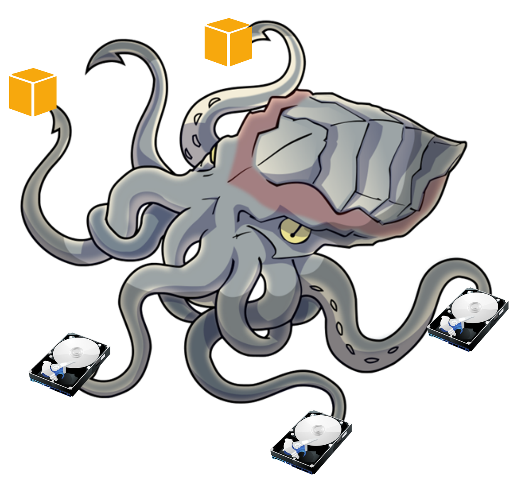

# kraken
### Attach & mount EBS volumes from inside EC2 instances

## What is it

Kraken runs from inside the EC2 instance (it's necessary for the instance to have an IAM Role with full EC2 access). 

By associating `instance tag.Prefix <-> volume tag.Prefix` and `instance tag.NodeId <-> volume tag.VolumeId`, it discovers which EBS volumes it needs to attach and mount.

### How do I use it

These are the tags you need:

| Tags       | Description             | EC2     | EBS    | Examples                                                         |
| ---------- | ----------------------- | ------- | -----  | ---------------------------------------------------------------- |
| Prefix     | Logical stack name      | *Yes*   | *Yes*  | `my_app_v1.3.4`                                                  |
| NodeId     | EC2 id within stack     | *Yes*   | *Yes*  | `0`, `1`, `2` for 3-node kafka                                   |
| VolumeId   | Distinct volume id      |         | *Yes*  | `0`, `0`, for 2-disk RAID, `0`, `1` for 2 separate single disks  |
| VolumeSize | # of disks in vol group |         | *Yes*  | 2 for 2-disk RAID, 1 for single disk/no RAID                     |
| RaidLevel  | level of RAID (0 or 1)  |         | *Yes*  | (0|1) for RAID, ignored if VolumeSize == 1                       |
| MountPath  | Linux path to mount vol |         | *Yes*  | `/var/kafka_data`                                                |
| FsType     | Linux filesystem type   |         | *Yes*  | `ext4`, `vfat`                                                   |

Run `kraken` from the EC2 instance (ideally at the user-data phase) to automatically mount the associated EBS volumes with the above properties.
